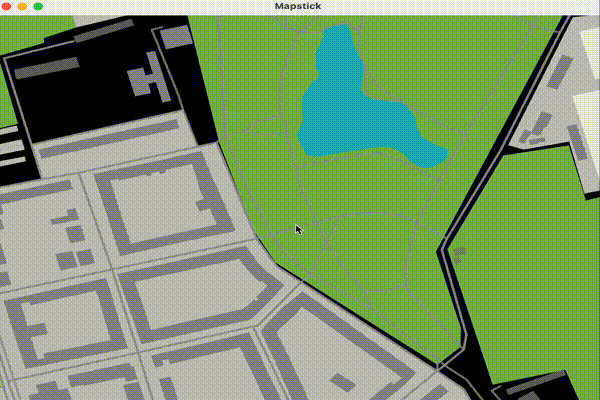

# Drawing maps

This is my attempt at drawing maps using Rust, for educational purposes for now.

As of now, I am using [`winit`](https://crates.io/crates/winit) for window management,
[`vello`](https://crates.io/crates/vello) for GPU rendering through
[`wgpu`](https://github.com/gfx-rs/wgpu), and OpenStreetMap vector data.

I am able to draw some features and layers of a single tile now:



## Data

Test data for a tile (like `tile1.mvt`) can be obtained from a
[.mbtiles](https://wiki.openstreetmap.org/wiki/MBTiles) file like this:

```bash
sqlite3 input-file.mbtiles "select writefile('tile1.gz',tile_data) from tiles limit 1"
```

This data is encoded according to [Vector Tile Specification](https://github.com/mapbox/vector-tile-spec/tree/master/2.1).
